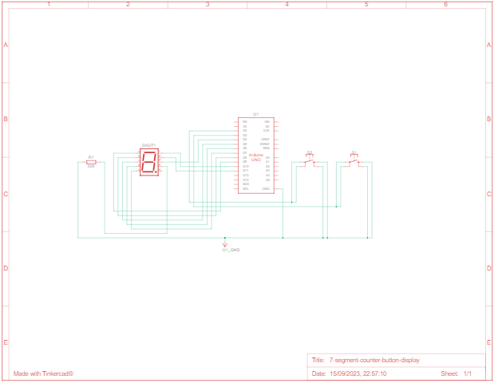
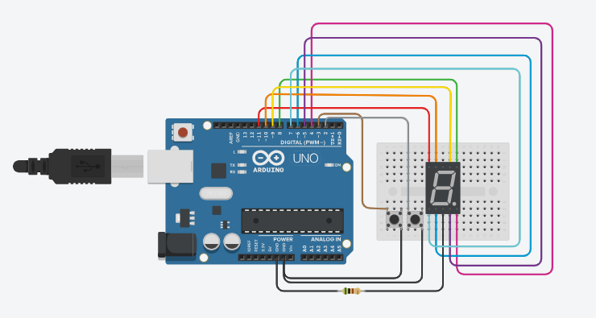

# 💡 Interrupt Call

The goal is to design a program for building a display that will show the number of times a button has been pressed, counting up to a maximum of 7. In this project, a 7-segment display is used to present the result. Two buttons will be used, A1 for counting and A2 for resetting the display value.

## 📦 Components
|Name  |Quantity|Component                  | Usage                   |
|------|--------|---------------------------|-------------------------|
|U1    |1       | Arduino Uno R3            |Use an Arduino Uno as the main control board.|
|R1    |1       | 500 Ω Resistor            |Use it to limit the current of the internal circuit of the display.|
|Digit1|1       | Cathode 7 Segment Display |Connect a 7-segment display to the Arduino Uno to show numbers from 0 to 7.|
|S1    |1       | Pushbutton                |Connect the digital input corresponding to the INT0 interrupt pin.|
|S2    |1       | Pushbutton                |Connect the digital input corresponding to the INT1 interrupt pin.|
|R2    |1       | pull-up Resistor          |Connect a pull-up resistor between the button pin and Vcc (power supply voltage).|

## 🤖 settings
| Schematic  | Circuit View |
|:----------:|:------------:|
|||

**Arduino Countdown Implementation:**

**1. Hardware Setup:**
  - 🧩 Connect the 7-segment display to the Arduino Uno.
  - 🌐 Wire the buttons and enable the pull-up resistor for proper functionality.

**2. Programming Steps:**
  - In your Arduino code:
    
    - 📌 Includes the necessary libraries to use AVR-specific functions and macros.
    - 📈 Declares a global variable `counter` to track the count.
    - 🛠️ Defines various functions (zero, one, two, etc.) that configure the microcontroller pins to display digits on the 7-segment display. Each function corresponds to a digit from 0 to 7.
    - 🏁 In the main function, configures the I/O pins (B0-B3 and D4-D7) as outputs (to control the 7-segment display) and sets the initial display to zero.
    - 🧩 Configures external interrupts INT0 (PD2 pin) and INT1 (PD3 pin) to detect the falling edge using EICRA.
    - 🚨 Enables global interrupts using `sei()`.
    - 🔁 Enters an infinite loop `while(1)` to keep the program running continuously.
    - 🛠️ Defines two interrupt service routines (ISRs): ISR(INT1_vect) and ISR(INT0_vect).
    - 🛠️ In the ISR(INT1_vect), an array of function pointers `display_num` is used to switch between display functions and increment the counter when the button associated with INT1 is pressed. The `Serial.print()` function is used for debugging (printing the current value of the counter).
    - 🛠️ In the ISR(INT0_vect), the display is reset to zero, and the counter is initialized again.

   **Solution:**
   ```c
  #include <avr/io.h>
  #include <avr/interrupt.h>
  #include <util/delay.h>
  
  unsigned int counter = 0;
  
  int main(void) {
    DDRB = 0b00001111;
    DDRD = 0b11110000;
    
    zero(); // starts counter with zero value and enable pull up setting
  
    EIMSK = 0b00000011; // enable INT0 and INT1 for external interruptions
    EICRA = 0b00001010; // configure INT0 and INT1 to falling endge
    
    sei();
    
    while(1){} // main process
    
    return 0;
  }
  
  ISR(INT1_vect) {
   void (*display_num[8])() = { zero, one, two, three, four, five, six, seven };
  
    if(counter < 7){
      counter++;
      Serial.print(counter);
      display_num[counter]();  
    }
  }
  
  ISR(INT0_vect) {
   zero();
   counter = 0;
  }
  ```

**3. Compilation and Uploading:**
   - Use the Arduino IDE to compile and upload your code to the Arduino Uno.

**4. Observing the Countdown:**
   - Press the button to initiate the countdown on the 7-segment display.

## Simulation

Platform: [Tinkercad.com](https://www.tinkercad.com/).

Watch the simulation video [here](https://youtu.be/FDYVAo9zPQs).

## 🫂 Authors

- [Ernane Ferreira](https://github.com/ernanej)
- [Quelita Míriam](https://github.com/quelita2)
- [Thiago Lopes](https://github.com/thiagonasmto)
